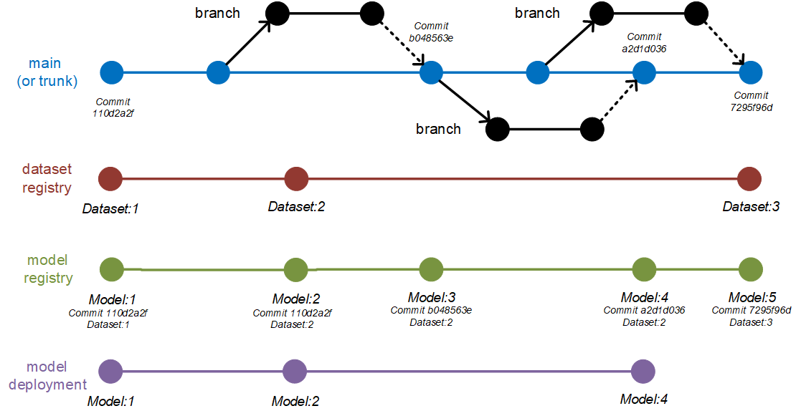
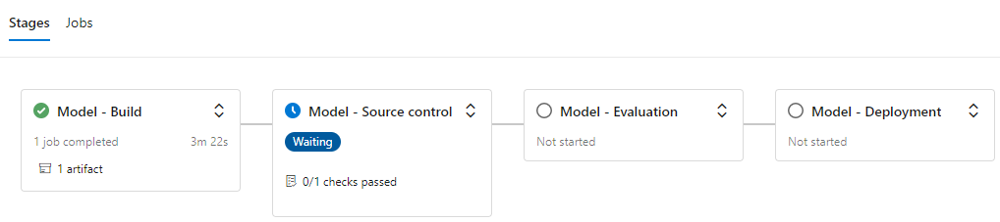
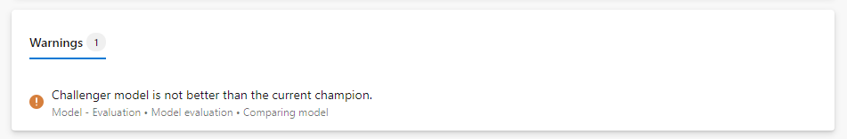
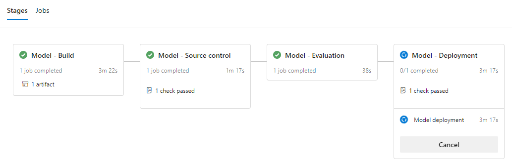

[](https://santiagxf.visualstudio.com/trunkbased-mlops/_build/latest?definitionId=15&branchName=main)
[](https://santiagxf.visualstudio.com/trunkbased-mlops/_build/latest?definitionId=12&branchName=main)
[](https://santiagxf.visualstudio.com/trunkbased-mlops/_build/latest?definitionId=14&branchName=main)

[](https://github.com/csu-devsquad-latam/trunkbased-mlops/actions/workflows/environment-cd.yaml)
[](https://github.com/csu-devsquad-latam/trunkbased-mlops/actions/workflows/environment-cd.yaml)
[](https://github.com/csu-devsquad-latam/trunkbased-mlops/actions/workflows/model-cd.yaml)


# Trunk-based development for Machine Learning models with Azure Machine Learning

This repository contains an example about how to use trunk-based development workflow in a Machine Learning project. It demostrates how apply the workflow in a sample project along with a CI/CD implementation in `Azure` cloud. The model we implemented here is a hate detection model for tweets in the portuguese language. The implementations of CI/CD pipelines doing continuous integration and deployment off all the assets required for the solution are provided for both `Azure DevOps` and `GitHub Acitions`. The implementations are equally capable and you can use whichever resonates more with you.

The resources deployed in `Azure` rely on `Azure Machine Learning`, which is a comprehensive set of tools to boost your work with machine learning projects in `Azure`. To know more about the components of this service you can visit [Get started with Azure Machine Learning](https://azure.microsoft.com/en-us/get-started/services/machine-learning/).

## Motivation

As always, technology is applied in the context of people and processes and there are no exceptions to this rule. A common pitfall when trying to use a git repository in a new ML project is to do so without any clear rules about how the repository should be used or how changes should be posted (committed). In the software development world, this is know as a workflow.

A lot of projects in ML start with a `git` repository, but without a clear strategy about how the repository will serve the goals of the team, and more importantly, how the resitory will allow to realise models faster and more reliably. For more details about this topic read the blog: [Put git to work for a Machine Learning projects: How to implement trunk-based development for Machine Learning models projects](https://santiagof.medium.com/put-git-to-work-for-a-machine-learning-projects-8ab79939b88d)

This repository contains all the required elements to deliver a model for hate detection in portuguese. The teams using this model works with the trunk-based development workflow to collaborate with others. The MLOps teams, uses either `GitHub Actions` or `Azure DevOps` to ensure that the workflow is followed, and the quality of the code is the expected. This allows to implement continuous delivery of the model using a method `champion/challenger` for deciding when to deploy a new version of the model.

## Landing trunk-based development in ML projects

Machine Learning models are a combination of data and code. As a consecuence, versioning the code is not enought nor versioning the data. In git workflow, `main` represents the official history of the solution, in our case the model, and should always be deployable. How can we make `main` always deployable considering that what we want to deploy is not the source code but the model? The model itself, which is the output of the training process, is the result of combining the model source code with the data.

Models are usually version controlled in a registry, in this case on `Azure Machine Learning` model registry. If we want to deploy a model from the registry, then according to trunk-based development it should be on main. This means that each model version corresponds to a version of main at same point in time.



*Each model version is associated with a given commit in the main branch. That makes main always deployable.*

If we see this in a different perspective, that means that `main` always contains the source code of the last model version since that would make `main` deployable.

> Note that this doesn’t mean that `main` is actually always deployed. The current version of the model in production may be different to the one in main since that depends on how delivery and releasing is happening.

## About the sample model

To ilustrate the use of this repository, we are including a sample project that tries to create a model to detect hate speech in tweet text in portuguese. The models uses `PyTorch` and the `transformers` library from `huggingface` to create a language model based on `BERT`. There are a lot of details about how this model is structured in a way to ensure good coding practices. For more information about that please check [Hate detection model details](docs/model.md)

## CI/CD

In the folder `.azure-pipelines` (for `Azure DevOps`) and in the folder `.github` (for `GitHub Actions`) you will find the following pipelines available:

### Workspaces

- **Workspace-CD:** Performs deployments and initialization of some of the elements of the workspace.
    - **Triggers on:** `main` for changes in path `datasets/*` and `workspaces/templates/*`
    - **Actions:**
        - **Infrastructure:** Infraestructure is deployed by code under IaC. The ARM templates are located in the folder `workspaces`.
        - **Datasets:** Ensures that datasets are created and available in the workspace. If they are not, they are initialized with data in the current git repository. For datasets that evolve over time, this pipeline will just create the initial version and the registration. You can leverage tools like Azure Data Factory to move data to the datasets and update the versions. This is outside of the scope of this repository right now but will be shared soon.


### Environments:

- **Environment-CI:** Performs build and basic validations on the environments. All environments in the environments folder will be built and validated.
    - **Triggers on:** Validations for PR into `main`
    - **Actions:**
        - Builds the environment proposed using `conda`
        - Check if the environments already exists in Azure ML and has the right version.
        - Ensure that if the environment details have changed, then a new version is proposed.
- **Environment-CD**: Performs validation and deployment of environments. All environments in the environments folder will be validated.
    - **Triggers on:** `main` for changes in path `environments/*`
    - **Actions:**
        - Check if the environment already exits in Azure ML and has the right version.
        - Look after changes in the environment definition and ensures the right version is used. If any change is introduced, new versions are deployed automatically.
        - Deploy the new version of the environment if needed.

### Models:

- **Model-CI:** Ensures that the model training can be executed and the code complies with standards.
    - **Triggers on:** Validations for PR into `main`
    - **Actions:**
        - Ensure the environment for training exists in Azure ML with the right version.
        - Builds the environment localy.
        - Run lintering.
        - Run unit tests.
        - Create a job for training and capture logs.
        - Publish logs into the assets of the pipeline.
        - Capture metrics, parameters and models and register them in the experiment.
- **Model-CD:** This pipeline is responsable of continuously building and deploying the last version of the model accourding to `main`. 
    - **Triggers on:** `main` for changes in path `src/*` and `jobs/*`.
    - **Actions:**
        - Stage 1: Model build
            - Ensure the environment for training exists in Azure ML with the right version.
            - Creates a training job and capture logs.
            - Builds the model and compute metrics.
        - Stage 2: Model source control
            - Registers model in the repository and associates it with the run that originated the model.
            - **Approvals:** This stage requires approval. This prevents the registration of an unwanted model.

                
        - Stage 3: Model evaluation
            - Evaluates model performance and detemines if the new model is better than the current one. This CI/CD implementation uses the champion/challenger approach meaning that the currently deployed model is the current champion. Each time a new model is trained, a challenger, it will be evaluated against the current champion. If success, then the challenger would take the place of the champion. Only one model is deployed at a time. If not, a warning will notify that no deployment will happen.

                
        - Stage 4: Model deployment
            - Deploys the new version of the model and updates the online endpoint.
            - **Approvals:** This stage requires approval.

                

### Endpoints
- **endpoint-CD:** Ensures that the last serving code for the model is deployed along with the last promoted model. This pipelines can update the serving code without updating the model.
    - **Trigges on:** `main` for changes in path `src/*/scoring` and `endpoints`.
    - **Actions:**
        - Deploys the last version of `main` in the current deployment of the model. No models are trained nor replaced.
        - Updates the references to know which version of the serving code is being installed on the endpoint. For this purpose we tag the commit SHA of the `main` by the time the deployed was done.
    - **Approvals:** This stage requires approval.

For a detail of the actions used to implement this pipelines see [Custom Actions](docs/actions.md).

## Starting using this project

To get yourself started using this repository, please follow the steps at [Quick start](docs/quickstart.md). After you are done, you will have to follow some configuration related to the CI/CD implementation. That will depend on the tool you are using. Follow [Quick start guide for Azure DevOps](docs/quickstart-devops.md) and [Quick start guide for GitHub Actions](docs/quickstart-github.md) depending which one you are using.


## Known issues

### #1 Pipeline `workspace-CD` failed in the datasets initialization steps with the error `trusted data source not found`

This issue looks to be related to a race condition in Azure Machine Learning. The data store created by ARM templates is created, but it looks that it is not ready to be used right after. The workaround to this issue is to re-run the pipeline. It will work next time.

### #2 Access denied errors when trying to preview datasets right after deployment

This issue, again, looks to be related to a race condition. It take same time to Azure ML to propagate permissions. Wait 15 minutes and try again.

### #3 Metrics are not being logged when using the library `common` provided in this repository

This issue is still under investigation. The workaround is to add an `sleep(5)` at the end of your training script to delay the execution.

```python
from time import sleep
from common.jobs.runner import TaskRunner
from hatedetection.train.trainer import train_and_evaluate

if __name__ == "__main__":
    tr = TaskRunner()
    tr.run_and_log(train_and_evaluate)
    sleep(5)
```

## Contributing

This project welcomes contributions and suggestions.  Most contributions require you to agree to a
Contributor License Agreement (CLA) declaring that you have the right to, and actually do, grant us
the rights to use your contribution. For details, visit https://cla.opensource.microsoft.com.

When you submit a pull request, a CLA bot will automatically determine whether you need to provide
a CLA and decorate the PR appropriately (e.g., status check, comment). Simply follow the instructions
provided by the bot. You will only need to do this once across all repos using our CLA.

This project has adopted the [Microsoft Open Source Code of Conduct](https://opensource.microsoft.com/codeofconduct/).
For more information see the [Code of Conduct FAQ](https://opensource.microsoft.com/codeofconduct/faq/) or
contact [opencode@microsoft.com](mailto:opencode@microsoft.com) with any additional questions or comments.

## Trademarks

This project may contain trademarks or logos for projects, products, or services. Authorized use of Microsoft 
trademarks or logos is subject to and must follow 
[Microsoft's Trademark & Brand Guidelines](https://www.microsoft.com/en-us/legal/intellectualproperty/trademarks/usage/general).
Use of Microsoft trademarks or logos in modified versions of this project must not cause confusion or imply Microsoft sponsorship.
Any use of third-party trademarks or logos are subject to those third-party's policies.
