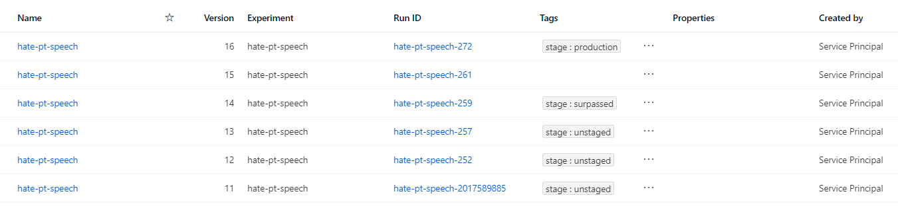
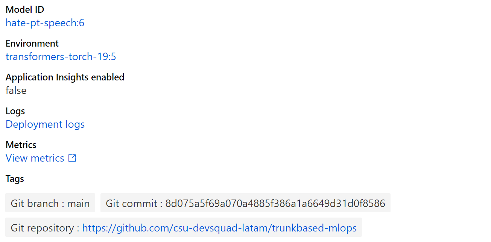

# Trunk-based development for Machine Learning models with Azure Machine Learning

This repository contains a working example about how to use trunk-based development git workflow in a Machine Learning project. It demostrates how apply the workflow in a sample project along with a CI/CD implementation for both `Azure DevOps` and `GitHub Acitions` (the implementations are equally capable) for automation and Azure Cloud as our cloud provider.

The resources deployed in `Azure` rely on `Azure Machine Learning`, which is a comprehensive set of tools to boost your work with machine learning projects in `Azure`. To know more about the components of this service you can visit [Get started with Azure Machine Learning](https://azure.microsoft.com/en-us/get-started/services/machine-learning/).

## Motivation

As always, technology is applied in the context of people and processes and there are no exceptions to this rule. A common pitfall when trying to use a git repository in a new ML project is to do so without any clear rules about how the repository should be used or how changes should be posted (committed). In the software development world, this is know as a workflow.

A lot of projects in ML start with a `git` repository, but without a clear strategy about how the repository will serve the goals of the team, and more importantly, how the repository will allow releasing models faster and more reliably. For more details about this topic read the blog: [Put git to work for a Machine Learning projects: How to implement trunk-based development for Machine Learning models projects](https://santiagof.medium.com/put-git-to-work-for-a-machine-learning-projects-8ab79939b88d)

## About this sample

We want to demostrate the power of this approach by using a real world scenario, as close as possible to reality. To do that, we picked a complex enough problem to solve. The objective is to create a model capable of detecting hate speech on text (NLP) coming from tweets in portuguese. The resulting model will be deployed as a REST web service that we can be use for instance to moderate a discussion. Although going over the modeling choices is out side of the scope of this repository, the model used here is based on the `transformers` library from `huggingface`, using `PyTorch` as a backend, and using a BERT-like architecture trained using transfer learning.

In this imaginary scenario (or not), there will be two teams working on the project: the development's team and the operation's team, botth using trunk-based development workflow to collaborate with others in a GitHub repository. The development team will iterate over the model to come up with the best model they can, and placing evaluation routines to decide which model is better and why. They own the source code of the model. The operation's team, on the other hand, uses either `GitHub Actions` or `Azure DevOps` to ensure that the workflow is followed, and the quality of the code is the expected. This allows to implement continuous delivery of the model using a method `champion/challenger` for deciding when to deploy a new version of the model. They own the deployment workflow of the model.

> We named the teams `development's team` and `operation's team` here to avoid the discussion about the details of them. Those team can be composed of `Data Scientist`, `Data Engineers`, `ML Engineers`, `MLOps Engineer`, `Cloud Engineer`, `Architects`, you named. The discussion is outside of the scope of this repository and probably there is not a single good answer about how they have to be composed of.

The repository is structured in a particular way so each time can own specific parts of it. Take into account that this structure is very opinionated and just a way to organize the structure that worked in this scenario. [See the details about how the repository is structured](docs/structure.md) and for a further discussion about why it is structured in this way check my post [Structure your Machine Learning project source code like a pro]().

## Landing trunk-based development in ML projects

Machine Learning models are a combination of data and code. As a consecuence, versioning the code is not enought nor versioning the data. In git workflow, `main` represents the official history of the solution, in our case the model. Trunk-based development demands that `main` should always be deployable, but, how can we make `main` always deployable considering that we want to deploy an ML model? **The model, which is the output of the training process, is the result of combining the model source code with the dataset**. This represents a bigger challenge when we consider that models are rarely versioned control on git. They are usually registered in what is called a *Model Registry*.

### The models' lifecycle

Models are usually version controlled in a model registry, in this case on [Azure Machine Learning's model registry](https://docs.microsoft.com/en-us/azure/machine-learning/concept-model-management-and-deployment). **This means that we won't deploy models from git, but from the registry.**. If you follow this line of thoughts, if we want to make `main` always deployable, that means that `main` always has to have a corresponding model trained and registered in the regitry. On another words, each model version corresponds to a version of main at same point in time.

If we see this in a different perspective, that means that `main` always contains the source code of the last model version since that would make `main` deployable. So now we know that mantaining this relationship between the last version of `main` and the last version of the model in the registry, is all we need to comply with trunk-based development.

> Note that "making main always deployable" doesn’t mean that `main` **is actually always deployed**. The current version of the model in production may be different to the one in main since that depends on how delivery and releasing is happening, which is a different story.

It may be situation where model registration is unwanted for any reason. For those cases, we propose that model registration may require approval in certain environments, like production for instance. This is proposed in our CI/CD implementation.

### Deployments' lifecycle

Once a model landed in the registry, then we have to make the decision if we want to deploy it or not. In general, this process is called **evaluation**. We want to make this decision independently from how the model is generated so, if at same point we change our minds about how models are evaluated, then we don't have to retrain all the models. If the decision is to deploy, then we should move forward.

If we are truly looking to automate this process in the future, then the evaluation process has to be robust enought to take into account multiple factors that can account for the model's performance in general. Although there are multiple ways to achieve this and will definetely depend on the business scenario, this repository will use the following apprach:

- We will use one of the simplest comparison strategies: **champion/challenger**. In this comparison strategy, there is always one model version in production, named **the champion**. The lat model registered in the model registry is called **the challenger**. Each time a model is registered in the registry, a comparison is executed to evaluate if **challenger** is better than **champion**. If this is true, **challenger** will be deployed and take the place of **challenger**.
    - Once you master this strategy you can consider more sophisticated ways like blue/green deployments, progressive rollouts, canary releases, you name it.
- The evaluation will take into account:
    - Point estimates of each model's performance.
        - Since the problem we are solving is a classification problem for hate detection, we will estimate model's performance using `recall`.
    - Statistical analysis the determine is the difference in the point estimates of the performances is statistically significant to justify a deployment.
        - Since the problem we are solving is a classification problem, we are going to use the statistical test **McNemmar** to detect if the performance difference observed in the models didn't occured by chance.

Sometimes, not all the aspects of a model evaluation can be automated and some human-driven evaluation needs to be performed. For instance, checking the errors distribution, revieweing how the model behaves in specific situation, etc. Because of that, manual approval is instructed as part of the evaluation process. Even when the evaluation favors the challenger model, someone has to approve this deployment in order to continue. 

### Datasets' lifecycle

We commonly see a `datasets` folder in git repositories containing the data the models uses for training (actually, this repository has such folder, but here it has a different mission). However, git is not the best place to store this kind of elements as it is not optimized for that for many reasons. So, datasets should be placed outside of git. The location will depend heavily in you complete data state architecture. Such discussions are outside of this repostiory. In our case, the data repository is Azure Data Lake Storage Accounts.

It should not be new to you that a model is the combination of code + data. Code is version-controlled on git, and datasets are version-controlled in whatever the mechanism the storage solution you are using offers. How can make an explicit linkage between the two of them? There are a couple of options here and there is no a single best one, but something we can do is to store datasets configuration on git (pointers).

#### Idea:

Dataset pointers are kept on git. If new datasets are registered, model is not altered until pointing to new version on git. This has some advantages and disadvantages:
- Datasets are static, so reproducibility is enforced.
- You have time to adapt to the new datasets because you can decide which one to use.
- Triggering a retraining requires new commit to update the pointers to the new dataset version. This implies challenges to do automatic retraining.

## Using MLOps to enforce the workflow

In the folder `.azure-pipelines` (for `Azure DevOps`) and in the folder `.github` (for `GitHub Actions`) you will find the following pipelines available:

### Workspaces

- **Workspace-CD:** Performs deployments and initialization of some of the elements of the workspace.
    - **Triggers on:** `main` for changes in path `datasets/*` and `.cloud/*`
    - **Actions:**
        - **Infrastructure:** Infraestructure is automatically deployed by the pipeline using ARM tempaltes. The ARM templates are located in the folder `.cloud`. To know more about the resources deployed see [Architecture details](docs/architecture.md).
        - **Datasets:** Ensures that datasets are created and available in the workspace. If they are not, they are initialized with data in the current git repository. For datasets that evolve over time, this pipeline will just create the initial version and the registration. You can leverage tools like Azure Data Factory to move data to the datasets and update the versions. This is outside of the scope of this repository right now but will be shared soon.

### Environments:

- **Environment-CI:** Performs build and basic validations on the environments. All environments in the environments folder will be built and validated.
    - **Triggers on:** Validations for PR into `main`
    - **Actions:**
        - Builds the environment proposed using `conda`
        - Check if the environments already exists in Azure ML and has the right version.
        - Ensure that if the environment details have changed, then a new version is proposed.
- **Environment-CD**: Performs validation and deployment of environments. All environments in the environments folder will be validated.
    - **Triggers on:** `main` for changes in path `environments/*`
    - **Actions:**
        - Check if the environment already exits in Azure ML and has the right version.
        - Look after changes in the environment definition and ensures the right version is used. If any change is introduced, new versions are deployed automatically.
        - Deploy the new version of the environment if needed.

### Models:

- **Model-CI:** Ensures that the model training can be executed and the code complies with standards.
    - **Triggers on:** Validations for PR into `main`
    - **Actions:**
        - Ensure the environment for training exists in Azure ML with the right version.
        - Builds the environment localy.
        - Run lintering.
        - Run unit tests.
        - Create a job for training and capture logs.
        - Publish logs into the assets of the pipeline.
        - Capture metrics, parameters and models and register them in the experiment.
- **Model-CD:** This pipeline is responsable of continuously building and deploying the last version of the model accourding to `main`. 
    - **Triggers on:** `main` for changes in path `src/*` and `jobs/*`.
    - **Actions:**
        - Stage 1: Model build
            - Ensure the environment for training exists in Azure ML with the right version.
            - Creates a training job and capture logs.
            - Builds the model and compute metrics.
        - Stage 2: Model source control
            - Registers model in the repository and associates it with the run that originated the model.

                

            - **Approvals:** This stage requires approval. This prevents the registration of an unwanted model.

                
        - Stage 3: Model evaluation
            - Evaluates model performance and detemines if the new model is better than the current one. This CI/CD implementation uses the champion/challenger approach meaning that the currently deployed model is the current champion. Each time a new model is trained, a challenger, it will be evaluated against the current champion. If success, then the challenger would take the place of the champion. Only one model is deployed at a time. If not, a warning will notify that no deployment will happen.

                
        - Stage 4: Model deployment
            - Deploys the new version of the model and updates the online endpoint.
            - **Approvals:** This stage requires approval.

                

### Endpoints
- **endpoint-CD:** Ensures that the last serving code for the model is deployed along with the last promoted model. This pipelines can update the serving code without updating the model.
    - **Trigges on:** `main` for changes in path `src/*/scoring` and `endpoints`.
    - **Actions:**
        - Deploys the last version of `main` in the current deployment of the model. No models are trained nor replaced.
        - Updates the references to know which version of the serving code is being installed on the endpoint. For this purpose we tag the commit SHA of the `main` by the time the deployed was done. The repository information is also added.

        

    - **Approvals:** This stage requires approval.

For a detail of the actions used to implement this pipelines see [Custom Actions](docs/actions.md).

## Starting using this project

To get yourself started using this repository, please follow the steps at [Quick start](docs/quickstart.md). After you are done, you will have to follow some configuration related to the CI/CD implementation. That will depend on the tool you are using. Follow [Quick start guide for Azure DevOps](docs/quickstart-devops.md) and [Quick start guide for GitHub Actions](docs/quickstart-github.md) depending which one you are using.

## Contributing

This project welcomes contributions and suggestions.  Most contributions require you to agree to a
Contributor License Agreement (CLA) declaring that you have the right to, and actually do, grant us
the rights to use your contribution. For details, visit https://cla.opensource.microsoft.com.

When you submit a pull request, a CLA bot will automatically determine whether you need to provide
a CLA and decorate the PR appropriately (e.g., status check, comment). Simply follow the instructions
provided by the bot. You will only need to do this once across all repos using our CLA.

This project has adopted the [Microsoft Open Source Code of Conduct](https://opensource.microsoft.com/codeofconduct/).
For more information see the [Code of Conduct FAQ](https://opensource.microsoft.com/codeofconduct/faq/) or
contact [opencode@microsoft.com](mailto:opencode@microsoft.com) with any additional questions or comments.

## Trademarks

This project may contain trademarks or logos for projects, products, or services. Authorized use of Microsoft 
trademarks or logos is subject to and must follow 
[Microsoft's Trademark & Brand Guidelines](https://www.microsoft.com/en-us/legal/intellectualproperty/trademarks/usage/general).
Use of Microsoft trademarks or logos in modified versions of this project must not cause confusion or imply Microsoft sponsorship.
Any use of third-party trademarks or logos are subject to those third-party's policies.
