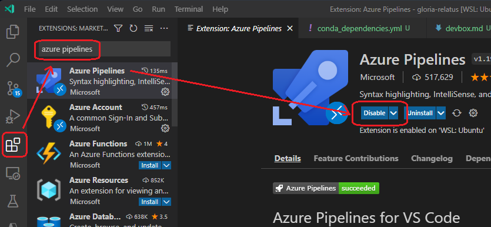
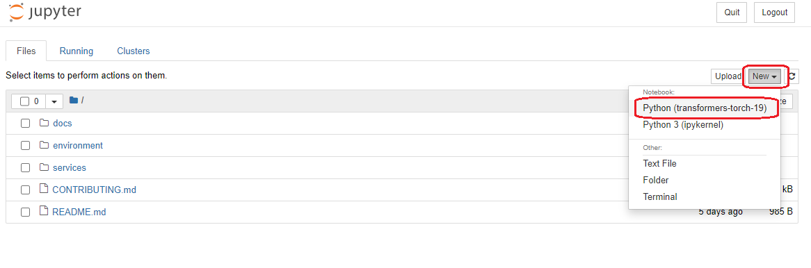
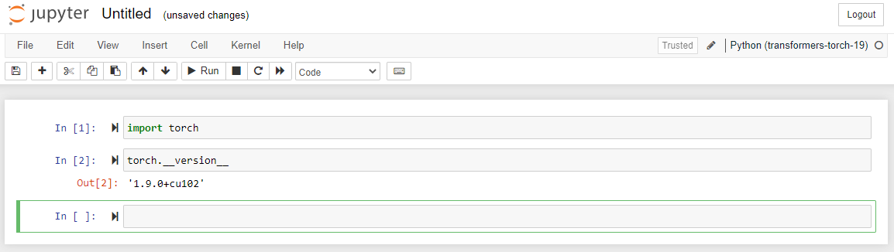

# Setting up your development box

In this guide you will see how you can set up your local environment to work with the technologies used in this repository.

## Install git

To work with this repository, you will need git installed in you machine. [Follow the instructions to install git according to your OS.](https://git-scm.com/book/en/v2/Getting-Started-Installing-Git)

## Python

You will need Python 3 running in your environment. If you are running in a Windows machine, we highly recommend to install it using the linux subsystem. This is to match as close as possible the production environment. Ww will use also a virtual environment manager that will allow us to avoid python libraries version collitions. In this case we will use `conda` (actually `miniconda`).

> If you are running Pyhton 2 (for instance, Python 2.7) we highly recommend to uninstall it to avoid pitfalls.

On Windows:
- [Follow the instructions to install WSL](https://docs.microsoft.com/en-us/windows/wsl/install)
- [Install Ubuntu (18.04 or 20.04)](https://www.microsoft.com/en-us/p/ubuntu/9nblggh4msv6)
- Follow the rest of the instruction.

Installing `miniconda`
- Open a terminal/Ubuntu console
- Run
    ```
    wget https://docs.conda.io/en/latest/miniconda.html#linux-installers
    bash Miniconda3-latest-Linux-x86_64.sh
    ```
- Follow the prompts on the installer screens. Accept the defaults, you can change them later.
- To make the changes take effect, close and then re-open your terminal window.

## IDE

You can use the IDE of your choice to write code in `Python`. Popular choices will be [PyCharm](https://www.jetbrains.com/pycharm/) and [VS Code](https://code.visualstudio.com/download). We highly recomend the last one as there are a couple of extensions we can use to improve the development experience.

### VS Code extensions

Please install the following extensions:

- Python
- Pylance
- Azure Machine Learning
- Azure Pipelines
- Jupyter
- Data Previewer



## Python environment

We have installed before `conda` which is a virtual environment manager. This will help us to create an specific environment for this project. Particularly, our environment contains the following libraries:

- azureml-sdk: the basic libraries to interact with Azure and Azure Machine Learning Services.
- transformers: a library provided by HuggingFace to work with NLP (natural language processing) in `Python`.
- torch: a deep learning modeling framework.
- pandas and numpy: basic libraries for handling data in `Python`.
- scikit-learn: basic library for computing metrics related with Machine Learning.
- jupyter: an interactive interface for writing code in `Python`.
- pytest: a testing suite for `Python`.
- pylint: a tool to check coding style in `Python`.

The proposed environment file is as follows:

```yaml
channels:
  - conda-forge
dependencies:
  - python=3.8
  - pip=20.2.4
  - pip:
      - azure-cli-core==2.30.0
      - pyOpenSSL==21.0.0
      - PyJWT==2.3.0
      - cryptography<=3.4.8
      - idna==2.10
      - azureml-core==1.37.0
      - azureml-defaults==1.37.0
      - azureml-telemetry==1.37.0
      - azureml-train-restclients-hyperdrive==1.37.0
      - azureml-train-core==1.37.0
      - torch==1.9
      - transformers==4.10
      - tensorboard==2.6
      - inference-schema[numpy-support,pandas-support]
      - pandas==1.3
      - numpy==1.19
      - scikit-learn==1.0.1
      - ipykernel==6.4
      - jupyter==1.0
      - pytest==6.2.5
```

This file is on `[repo]/environments/transformers-torch-19-dev/conda_dependencies.yml`. To create this environment in your machine follow this instructions.

- Open a Terminal/Ubuntu console:
- Move to the root of the repository
- Run the following command:

    ```bash
    conda env create --name transformers-torch-19-dev -f environments/transformers-torch-19-dev/conda_dependencies.yml
    ```
- Activate the environment
    ```
    conda activate transformers-torch-19-dev
    ```

- Test you environment works:

    ```bash
    python -c "import torch; print(torch.__version__)"
    ```

    It should generate an output as follows:
    ```bash
    1.9.0+cu102
    ```

> **Note:** From now on, everytime you have to run any command, remember to have activate the environment before with `conda activate`. You can tell if you did so because you will see the name of the environment in parentesys like this:

```bash
(transformers-torch-19) santiagxf@surface:~/repos/devsquad/trunkbased-mlops$
```

## Jupyter

Jupyter is a well know development environment that can help to quickly develop Python code in an interactive way. We may use it pretty frequently. Our conda environment has this software already installed, but not configured. Follow this steps to get it configured:

- Open a Terminal/Ubuntu console
- Move to the root of the project
- Activate our environment:
    ```
    conda activate transformers-torch-19-dev
    ```
- Install a kernel in Jupyter that points to our environment
    ```
    python -m ipykernel install --user --name transformers-torch-19-dev --display-name "Python (transformers-torch-19-dev)"
    ```

Let's verify that the kernel is correctly installed and ready to use inside Jupyter.

- In a Terminal/Ubuntu console
- Start Jupyter server:
    ```bash
    jupyter notebook --no-browser
    ```
- You will see the message "Serving notebooks from local directory: /home/santiagxf/repos/csu/gloria-relatus"
- Copy the URL that stars with `http://localhost:8888`, and paste it in a browser. Tip: you might be able yo just press CRTL+CLICK to open it directly in the browser:
    ```
    http://localhost:8888/?token=a85a390cdcf7c2850942a24488edcc0c474ffa9c03a4d7b7
    ```
- Crate a new sample notebook by pressing the option `New`. You will see the environment name in the list:

    

- Try to load `PyTorch`

    
    
## Azure CLI and ML CLI

Most of the work we will do will interact with Azure Machine Learning Services, a platform to assist during the machine learning development cycle. We will interact with it using a command line utility (CLI).

- [Follow the instructions](https://docs.microsoft.com/en-us/cli/azure/install-azure-cli) according your OS. If you are running Windows, [install it using WSL](https://docs.microsoft.com/en-us/cli/azure/install-azure-cli-linux?pivots=apt). If you already have the CLI installed, make sure it is the last version with:

    ```
    az upgrade
    ```
- Install the Azure ML CLI:
    ```bash
    az extension add -n ml -y
    ```
- Once the CLI is installed, verify you can access the resources. For that, first log into Azure:
    ```bash
    az login
    ```
- Point your console to the Azure subscription we are using in this project:
    ```bash
    az account set --subscription "************"
    ```
- Configure default values for working in the Azure Machine Learning workspace:
    ```bash
    az configure --defaults group="rg-trunkbased-mlops-dev" workspace="mlw-trunkbased-mlops-dev"
    ```
- Test you can access the resources:
    ```bash
    az ml workspace list
    ```

    You will see an output like this one:

    ```json
    [
        {
            "application_insights":"..",
            "container_registry": "..",
            "description": "",
            "discovery_url": "https://centralus.api.azureml.ms/discovery",
            "display_name": "",
            "hbi_workspace": false,
            "image_build_compute": "",
            "key_vault": "..",
            "location": "centralus",
            "mlflow_tracking_uri": "..",
            "name": "mlw-trunkbased-mlops-dev",
            "public_network_access": "Disabled",
            "resource_group": "rg-trunkbased-mlops-dev",
            "storage_account": "..",
            "tags": {
            "environment": "dev"
            }
        }
    ]
    ```

    Note: some long texts have been replaced by "..."

## Running tests and ensuring quality

Before comming code in the repository, ensure tests run and code match our quality level.

Running tests:
```
cd src
python -m pytest
```

Running lintering:
```
cd src
python -m pylint <modelname> --disable=C0103,C0301,W1203,W0603
```

> <modelname> is the name of any Python module containing the model you want to validate. For instance `python -m pylint hatedetection --disable=C0103,C0301,W1203,W0603`. Some checks are being disabled as we don't comply with them in our code base but we are required to write in such way. Particularly the use of global variables is required for Azure ML and sentence longitud are required to be long as sometime they may introduce unwanted linebreaks.