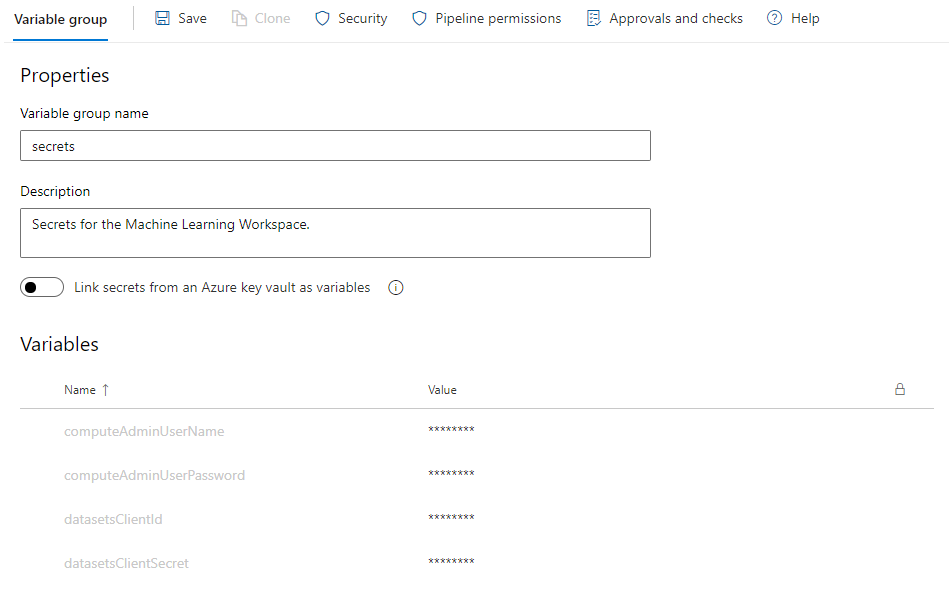
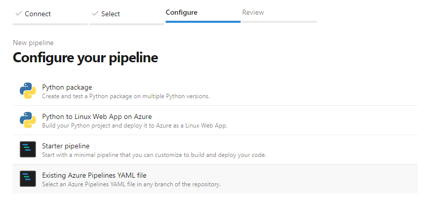
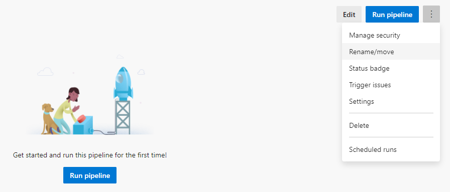
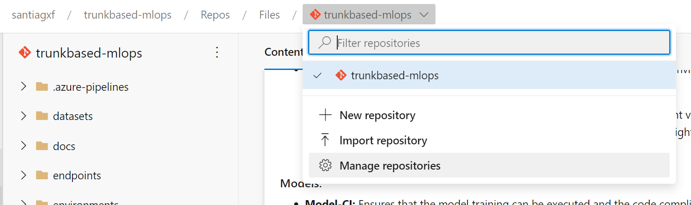
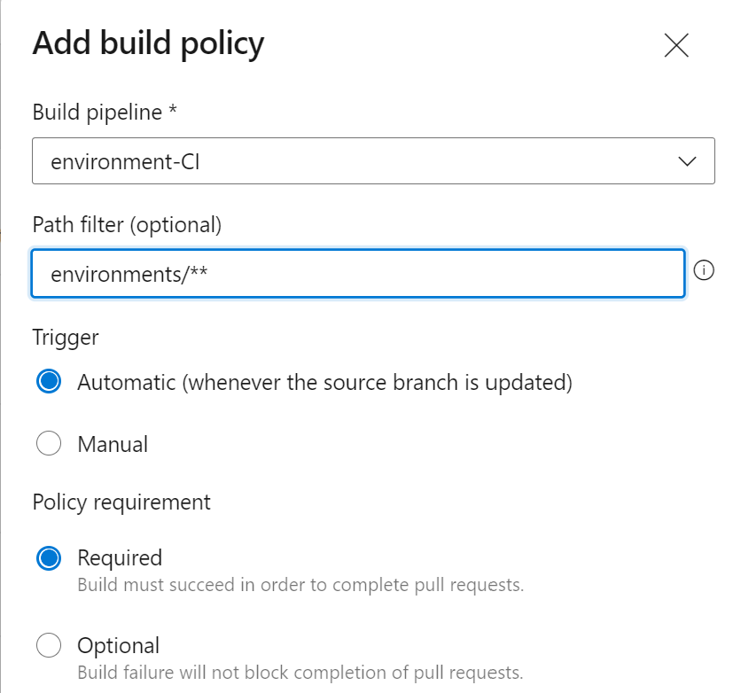
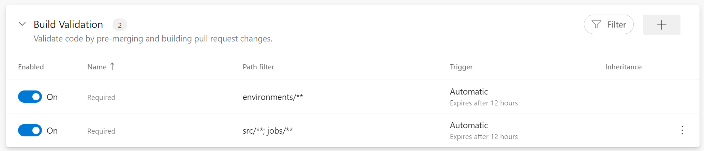
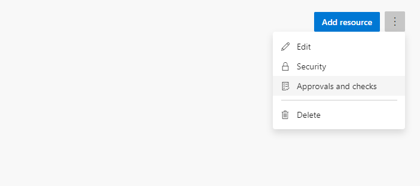
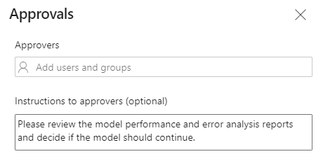

# Quick start for Azure DevOps Pipelines

This guide will guide you to configure this project in Azure DevOps.

## Configure a service connection to Azure

The automated pipelines in this repository will interact with Azure Machine Learning resources located in an Azure subcription. In order to do that, we need to connect Azure DevOps to the Azure subscription you want to use.

To do that:
1. Go to project settings and select `Service Connections` under the section `Pipelines`.
2. Click on `New Service Connection`.
3. Select `Azure Resource Manager`.
4. Select `Service Principal (Manual)` - Feel free to use any other option if you cansider so.
5. Indicate all the required values, including the Subcription ID where the resources are and name. You will need here all the information from the Service Principal account that you created before.
6. Give the connection a name, for instance. It is always a good practice that the name of the connection ends with the name of the environment. For instance, if this connection is for a `development` environment, then it will be like `rg-mlops-project-dev`. Remember this name as you will need it later. 
7. Check the option `Grant access permission to all pipelines`.
8. Test the connection and save.

## Configure your environment variables

The automated pipelines in this repository will use a set of variables to configure how the deployment should be done and where. Those variables are located in a `YAML` file for convenience.

> Note: Placing configuration inside of a `YAML` file in the repository may not be the best choice in an enterprise setting. In this repository is used to reduce the amount of configuration you have to do in Azure DevOps. Consider moving that configuration to a `Variable group`. Check [Add & use variable groups](https://docs.microsoft.com/en-us/azure/devops/pipelines/library/variable-groups?view=azure-devops&tabs=classic)

Open the file `.azure-pipelines/variables.group.yml` and review the values of the following variables. Save the changes in this file and commit the changes to the repo.

- `SERVICECONNECTION`: It is the name of the service connection you created in the previous step.
- `WORKSPACENAME`: The name of the Azure Machine Learning workspace you want to use.
- `RESOURCEGROUPNAME`: The name of the resource group where the resources are located.
- `STORAGEACCOUNTNAME`: The name of the storage account where you want datasets to be placed. This datastorage account has to have a container named `trusted` and be configured as a data source in Azure Machine Learning with the name `trusted`.

The following variables are also present, but are specific to the project you are working on.

- `env`: Name of the environment. By default its `dev` reffering to `development`. Possible values can be `qa`, `stg` and `prd`.
- `modelName`: The name of the model you are building. 
- `description`: Description of the model you are building.
- `condaEnvName`: Name of the environment that the model uses for training. This environment should match any of the environments that are available under the folder `environments`.

## Configure secrets

Infrastructure is deployed automatically by IaC pipelines. However, some secrets are required and needs to be provided in the form of Azure DevOps Variable Group. To configure that:

1. On Azure DevOps, on the `Pipelines` tab, go to `Library`.
2. Click on `+ Variable group`.
3. Named secrets and configure the following secrets:

    - `datasetsClientId`: The Client ID of the service principal created before.
    - `datasetsClientSecret`: The Client Secret of the service principal created before.
    - `computeAdminUserName`: The user name of the compute instances you want to use. For instance `mladmin`.
    - `computeAdminUserPassword`: The password used for compute instances. For instance `Pass@word1`.
    - `AUTOMATION_OBJECT_ID`: The object id of the service principal used in the azure service connection.

        > To get the Object ID of a service principal follow this steps: [Find service principal object ID](https://docs.microsoft.com/en-us/azure/healthcare-apis/azure-api-for-fhir/find-identity-object-ids#find-service-principal-object-id). **DO NOT USE THE OBJECT ID displayed in the Azure Portal.**

        `az ad sp show --id XXXXXXXX-XXXX-XXXX-XXXX-XXXXXXXXXXXX --query objectId`

It should look like something like this:

## Create the pipelines

We need to create the pipelines that are available in this repository. 5 pipelines in total needs to be created:

 * Workspace-CD
 * Environment-CI
 * Environment-CD
 * Model-CI
 * Model-CD

Each of them is specified in a file inside the folder `.azure-pipelines` as a `YAML` file. To create this pipelines, for each of them follow this steps:

1. In Azure DevOps, go to the tab `Pipelines and click on New pipeline.
2. Select the repository where your code is located. Probably it would be `Azure Repos Git`. Then select the name of the repository.
3. On the stage `Configure`, select the option `Existing Azure Pipeline YAML file`.

    

4. On the tool bar at the right, expand the drop down in `Path` to select the path to the `YAML` file containing the pipeline. Remember that each pipeline is specified in a `YAML` file of the same name so `Workspace-CD` is specified on `.azure-pipelines/workspace-cd.yaml`
5. Click on continue.
6. You will have the change then to modify the pipeline. Ignore this step by clicking on the drop down `Save and run` and click `Save`. We don't want to run it yet.
7. After that, open the pipeline again and in the three dots menu on the right select `Rename`. Change the name of the pipeline to the correct one. By default all pipelines will be named the name of the repository.

    

8. Save the changes.

Repeat all the steps for each of the pipelines.

## Configure repository policies

1. On the navigation bar in the top of the page, select the drop down and click on `Manage repositories`.

    

2. Select the name of the repository you want to control.
3. Go to the tab `Policies`
4. On the section `Branch policies`, click on `main`
5. Add rules to run the pipelines `model-CI` and `environment-CI` each time models and environments are modified. 

    

6. Rules should look like this:

    

7. Save the changes.

## Configure approval gates

Certain actions in the pipeline, like a deployment, will require approval. To configure how approval works:

1. Go to the `Pipelines` tab and then select `Environments`
2. You will see an environment automatically added, named `amlworkspace_dev`. Click on it.
3. On the three dots options menu at the right, select `Approvals and checks`

    

4. Click on the plus sign, and then `Approvals`.
5. Select the people or security groups that you want to approve or reject each time a model needs to move to a protected stage. 

    
6. Click on save.

## Getting the project runnning

Run pipelines in the following order:

1. Workspace-CD
    - This will ensure the infrastructure is deployed and datasets created.
2. Environment-CD
    - This will ensure the environments to run training jobs are avaiable.
3. Model-CT
    - This will start the training of a model. Once a model is registered, then the pipeline Model-CD will run automatically.