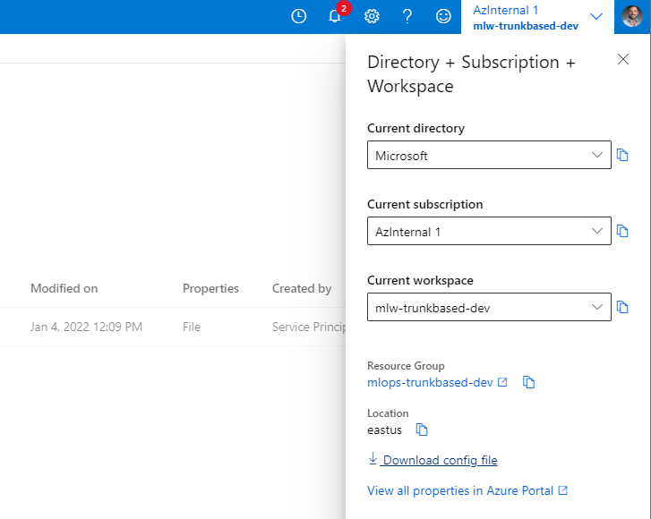

# Quick start

This guide will walk you through all the steps required to use this repository in your project.

## Prerequisites

You will need the following elements to work with this repository.

1. An Azure Subscription with owner rights.
2. A resource group created under the subcription where all the resources will be placed. If you want to start with a clear resource group, follow the steps [Create a resource group](https://docs.microsoft.com/en-us/azure/azure-resource-manager/management/manage-resource-groups-portal#create-resource-groups)

## Create a service principal to run the automation pipelines using such credentials

The automated pipelines provided in this repository will require credentials to do the work. To create a service principal you can follow the steps at [Use the portal to create an Azure AD application and service principal that can access resources](https://docs.microsoft.com/en-us/azure/active-directory/develop/howto-create-service-principal-portal).

> Please take note of the following properties of the service principal: `client id`, `client secret` and `tenant id`.

## Grant the service principal access to the resources

Enure the service principal has at least `contribute` acccess to the resource group you created before. To do that follow [Assign Azure roles using the Azure portal](https://docs.microsoft.com/en-us/azure/role-based-access-control/role-assignments-portal?tabs=current)

## Create an Azure Machine Learning resource

Create an Azure Machine Learning resource inside of the resource group. Follow the steps at [Quickstart: Create workspace resources you need to get started with Azure Machine Learning](https://docs.microsoft.com/en-us/azure/machine-learning/quickstart-create-resources).

## Get the workspace profile

The workspace profile is used in order to provide conectivity with the workspace in some scenarios. To download the profile:

1. Go to `https://ml.azure.com` and select the workspace you just created.
2. On the top right corner, where the subscription is listed along with your workspace name, click on the arrow.

    

3. On the menu, click on `Download config file`.
4. Save the file in the repository on the folder `workspaces/dev`.
5. Commit the changes.

