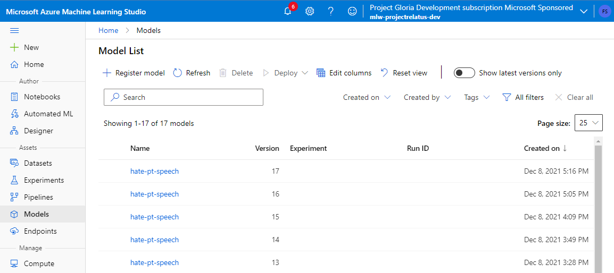

# Source control


## Machine Learning components

### Assets

We mainly deal with the following assets which we want to source and control. Since ML systems are a combination of code and data, this brings specific challenges and complexity in the way we manage each of this assets:

- **Models:** They represent knowledge extracted from data. The model is the output generated from the source code that generates the model and the snapshop of the dataset at a given time. In this context is important to distinguish some other assets related:
    - Source: code used to generate the model.
    - Configuration/hiperparameters: parameters used to train the model which determine the output model.
    - Metrics and outputs: assets generated by the training process, including any metrics evaluated. We treat that as model metadata.
- **Datasets:** what models are trained on. Datasets are snapshot of the source data at a given time.
- **Environments:** software configuration where training and inference will happen.
- **Deployments:** where models get executed.

### Where do we source-control each asset?

Each components is being source-controled in the following ways:

- **Models:**
    - **source:** git under path `src`.
    - **configuration/hiperparameters:** git under path `src` in `YAML` files.

        ```yml
        model:
            name: 'hate-pt-speech'
            baseline: 'neuralmind/bert-base-portuguese-cased'
            output_dir: './outputs'
        trainer:
            output_dir: './results'
            logging_dir: './logs'
            num_train_epochs: 3
            per_device_train_batch_size: 256
            per_device_eval_batch_size: 256
            warmup_steps: 500
            weight_decay: 0.01
        data:
            format: 'csv'
        ```
    - **metrics and outputs:** Azure Machine Learning run registry.
    - **model:** Azure Machine Learning model registry.

        

- **Datasets:**
    - **Initial version:** git inside the folder `datasets`. Data is accompanied by a YML file that describes how the data should be read.
    - **Live versions:** Azure Data Lake in folder `/trusted/datasets`.

        

- **Environments:** git under path `environments` and Azure Machine Learning environments registry.