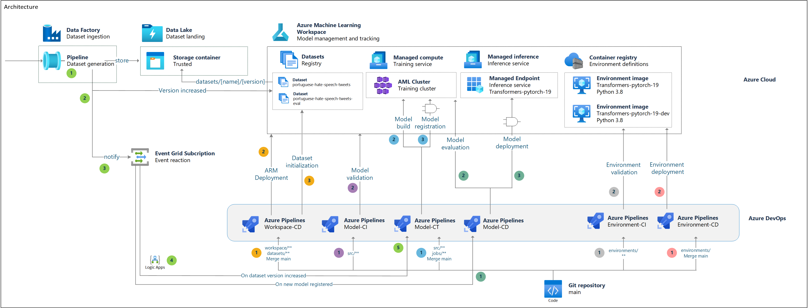

# How git repository interacts with Azure ML workspace

We propose to use `git` as the central repository and the single source of truth. That means that any change that anyone wants to introduce to the project needs to be introduced by changing something in the repository.

> See [project structure](structure.md) to have a reference about which persona is supposed to change each folder in the repository.

To keep in sync the current state of the Azure ML workspace and the git repository, a series of pipelines interact with the workspace to ensure the relationship between git and Azure ML.

> Note that in this implementations, users shall not have permissions to modify the workspace directly, but read-only access. All changes are introduced by automated pipelines that run under special credentials. At least this is true for `qa` and `prd` environments. Advisable for `dev` environments.

The following ilustration shows how the pipelines interact with each element in the workspace.

## Workflows:

### Changing the infrastructure or datasets configuration in the workspace (orange reference)

Each time changes to the infrastructure are required, including new compute clusters, or new data sources, those changes are introduced by modifying the ARM template specified in `.cloud`. When new datasets needs to be used by data scientist, then the folder `datasets` is modified to include them. A CD pipeline will automatically trigger by then:

1. Changes are introduced in `.cloud` or `datasets` and merged into `main`.
    1. Since `main` is protected, a new branch is created where changes are introduced.
    2. A PR is created to merge into `main`. 
2. The `ARM` template is deployed to the target environment. Changes are processed and applied by the automated pipeline Workspace-CD.
3. Datasets are created if missing. If missing and initialization data is available, it is uploaded to Blob Storage. Data is always kept in Cloud storage.

### Trying to integrate changes into the current model (purple reference)

Each time a developer needs to introduce changes in the model, they will change the source code indicated in `src`. All the changes can be made in their own branch, since main is protected and they can't push changes directly to it. When the changes are ready, they will create a PR into main. At that time, validations will be triggered to ensure that the code works. 

1. Changes are introduced in `src` or `jobs`
    1. Since `main` is protected, a new branch is created where changes are introduced in either the model code - `src` folder - or in the way the model is created - `jobs` folder.
    2. a PR is created.
2. Model-CI is triggered to run validations. If passed, the developer will be ready to merge into `main`.

### Introducing changes into the current model (blue reference)

Once a developer is ready to merge the changes in the current model into `main`, the pipeline model-CD will be triggered.

1. Changes in `src` or `jobs` are merged into `main`.
2. Model is built in a job in remove compute by the pipeline Model-CD.
3. Model is registered if validations are passed and approved.
    1. Only people registered to approve the registration in the current environment (dev, qa, prd) can approve registration. Typically they will validate the model according to their standard.
4. Model performance is assessed against the evaluation dataset. The evaluation method depends on the model implementation. In this repository the evaluation uses McNemar test.
5. Model is deployed is the model performance is better than the current one and approvals are passed.
    1. Only people registered to approve the deployment in the current environment (dev, qa, prd) can approve deployment.

### Introducing changes in the scoring code (green reference)

Some times, the inference code that is run along with the model needs to be changed. However, the model does not. This changes will be applied in the `src` folder, in the module `score`.

1. Changes are introduced in the scoring code and merged into `main`.
    1. Since `main` is protected, a new branch is created where changes are introduced in `src/*/score` folder.
    2. a PR is created and merged.
2. The pipeline Endpoint-CD is executed and source code is updated.
    1. Only people registered to approve the deployment in the current environment (dev, qa, prd) can approve deployment.
    2. Model tags are updated.

### Trying to introduce changes in an environment definition (gray reference)

Each time data scientist need to use a library or something special to make their models to work, those libraries needs to be indicated in the environment definition. Environments are indicated in the folder `environments`.

1. Changes are introduced in `environments` folder, by either creating a new one or by modifying the existing one. If modifications are made, then the version needs to be increased for validations to work.
2. Validations are performanced by Environment-CI which will check versioning and that the environment can be created correctly.

### Introducing changes in an environment definition (red reference)

Once the developer or engineer is ready to merge the changes in the environment definition into `main`, the pipeline environment-CD will be triggered.

1. Changes are introduced in the folder `environments`.
2. Environments are validated and deployed in the target workspace. Note that no models will use this environment definition unless jobs/deployments are updated to for pointing to this new version.
