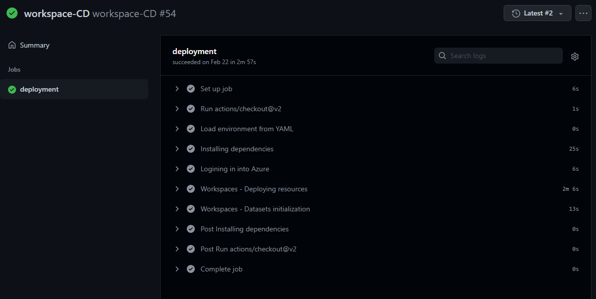
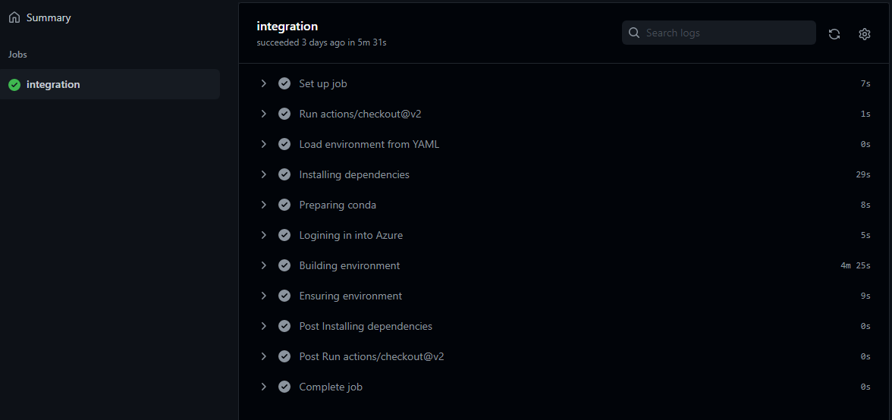
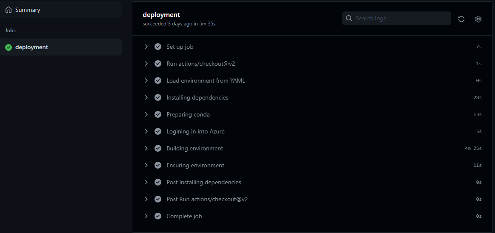
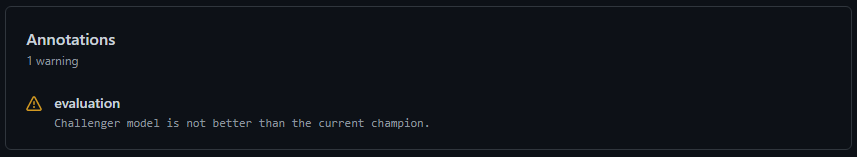

# Azure DevOps / GitHub Actions workflows

## Workspaces

### Workspace-CD: Azure ML Workspaces Continous Deployment

Performs deployments of the Azure Machine Learning resources using Infrastructure as Code (IaC) and ensure workspaces' assets including datasets, data sources and compute clusters.

- **Triggers on:** `main` for changes in path `datasets/*` and `.cloud/*`
- **Actions:**
    - **Infrastructure:** Infraestructure is automatically deployed by the pipeline using ARM tempaltes. The ARM templates are located in the folder `.cloud`. To know more about the resources deployed see [Architecture details](docs/architecture.md).
    - **Datasets:** Ensures that datasets are created and available in the workspace. If they are not, they are initialized with data in the current git repository. For datasets that evolve over time, this pipeline will just create the initial version and the registration. You can leverage tools like Azure Data Factory to move data to the datasets and update the versions. This is outside of the scope of this repository right now but will be shared soon.

        

## Environments:

### Environment-CI: Training/Inference environments Continuous Integration

Performs the build and basic validations on the training and inference environments. All environments in the `environments` folder will be built and validated, regardless of if they are used for training/inference or not.

- **Triggers on:** PR into `main` for paths `environments/*`
- **Actions:**
    - Builds the environment proposed using `conda`
    - Check if the environments already exists in Azure ML and has the right version.
    - Ensure that if the environment details have changed, then a new version is proposed.

        

### Environment-CD: Training/Inference environments Continuous Deployment

Performs validation and deployment of environments. All environments in the environments folder will be validated.

- **Triggers on:** `main` for changes in path `environments/*`
- **Actions:**
    - Check if the environment already exits in Azure ML and has the right version.
    - Look after changes in the environment definition and ensures the right version is used. If any change is introduced, new versions are deployed automatically.
    - Deploy the new version of the environment if needed.

        

## Models:

### Model-CI: Model Continuous Integration

Ensures that the model training can be executed in the indicated training environment and that the source code complies with quality standards

- **Triggers on:** Validations for PR into `main`
- **Actions:**
    - Ensure the environment for training exists in Azure ML with the right version.
    - Builds the environment localy.
    - Run lintering.
    - Run unit tests.
    - Create a job for training and capture logs.
    - Publish logs into the assets of the pipeline.
    - Capture metrics, parameters and models and register them in the experiment.

        

### Model-CT: Model Continuous Training

Responsable for continous training of the model and its corresponding registration in model's registry. This pipeline ensure `main` is always deployable. 

- **Triggers on:** `main` for changes in path `src/*` and `jobs/*`.
- **Actions:**
    - Stage 1: Model build
        - Ensure the environment for training exists in Azure ML with the right version.
        - Creates a training job and capture logs.
        - Builds the model and compute metrics.
    - Stage 2: Model source control
        - Registers model in the repository and associates it with the run that originated the model.
        - **Approvals:** This stage requires approval. This prevents the registration of an unwanted model.

    

### Model-CD: Model Continuous Deployment

Responsable of the continuos evaluation and deployment of new trained models. This workflow also tags the models using an specific tag, `stage`, to help identify the stage at which a model is currently in the registry. Check [model stages](#model-stages) for more details.

- **Triggers on:** On new model version registered.
- **Actions:**
    - Stage 1: Model evaluation
        - Evaluates model performance and detemines if the new model is better than the current one. This CI/CD implementation uses the champion/challenger approach meaning that the currently deployed model is the current champion. Each time a new model is trained, a challenger, it will be evaluated against the current champion. If success, then the challenger would take the place of the champion. Only one model is deployed at a time. If not, a warning will notify that no deployment will happen.

            

        - If model evaluation favors the challenger, then the model stage is changed to `staged`. Only one model at time can be staged, so any other model in this stage will be moved to stage `unstaged`. `staged` indicates models are are ready for review and deploy.

    - Stage 2: Model deployment
        - Models the stage of the model to `production`. Meaning that this model version is the one about to be deployed. The previous model in `production` stage will be moved to stage `surpassed`, meanining that the model was overtaken in favor of a better model.
        - Deploys the new version of the model and updates the online endpoint.
        - Updates the references to know which version of the serving code is being installed on the endpoint. For this purpose we tag the commit SHA of the `main` by the time the deployed was done. The repository information is also added.
        - **Approvals:** This stage requires approval.

            

            

## Model stages

Some of these workflows make use of a specific tag in models registry to help identify the stage at which any model is currently.

| Tag       | Value        | Description                                                             |
|-----------|--------------|-------------------------------------------------------------------------|
| `stage`   | `staged`     | The model has won the evaluation and is ready to be deploy if approved. |
| `stage`   | `unstaged`   | Any model that was previously in `stage=staged` will move to this stage when a new one takes its place. This indicate a model that won a comparison that has never been deployed |
| `stage`   | `production` | The model is the one that is currently deployed in the endpoint         |
| `stage`   | `surpassed`  | The model was once deployed but now its place was taken but a better model that was deployed. This indicates a model that has been deployed at some point but now it is not longer being used |
| `stage`   | Tag missing  | A model that never made it through the evaluation process will have this tag missing |

The following image showcases some of this examples:

